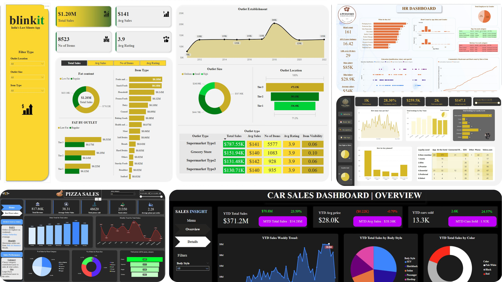

# Power BI Dashboards

Welcome to the Power BI Dashboards collection. This folder contains a set of interactive dashboards created using Microsoft Power BI, each designed to solve specific business problems or visualize key metrics across various domains. These projects demonstrate strong skills in data modeling, DAX, visualization, and storytelling with data.

## 📊 Dashboards Overview

### 1. Blinkit Sales Dashboard
- **Purpose**: Analyze sales performance, customer behavior, and delivery metrics for Blinkit (a grocery delivery platform).
- **Key Insights**: Total revenue, top-selling products, order trends, and delivery times.

### 2. Car Sales Dashboard
- **Purpose**: Provide an overview of car sales data, dealer performance, and market trends.
- **Key Insights**: Sales by brand/model, regional performance, yearly trends, and inventory status.

### 3. Hotel Bookings Dashboard
- **Purpose**: Track and analyze hotel booking data to identify occupancy rates, cancellation patterns, and booking sources.
- **Key Insights**: Booking lead time, distribution channel performance, guest segmentation, and seasonal trends.

### 4. HR Dashboard
- **Purpose**: Visualize employee-related metrics for HR decision-making.
- **Key Insights**: Headcount trends, department-wise distribution, attrition rates, gender diversity, and average tenure.

### 5. Pizza Sales Dashboard
- **Purpose**: Monitor pizza shop performance and identify popular products and customer trends.
- **Key Insights**: Sales by category (pizza, drinks, etc.), order distribution by day/hour, and top-performing menu items.

## 🔧 Tools & Technologies
- **Power BI Desktop**
- **DAX (Data Analysis Expressions)**
- **Data Modeling**
- **ETL (Extract, Transform, Load)**

## 📁 Folder Structure

